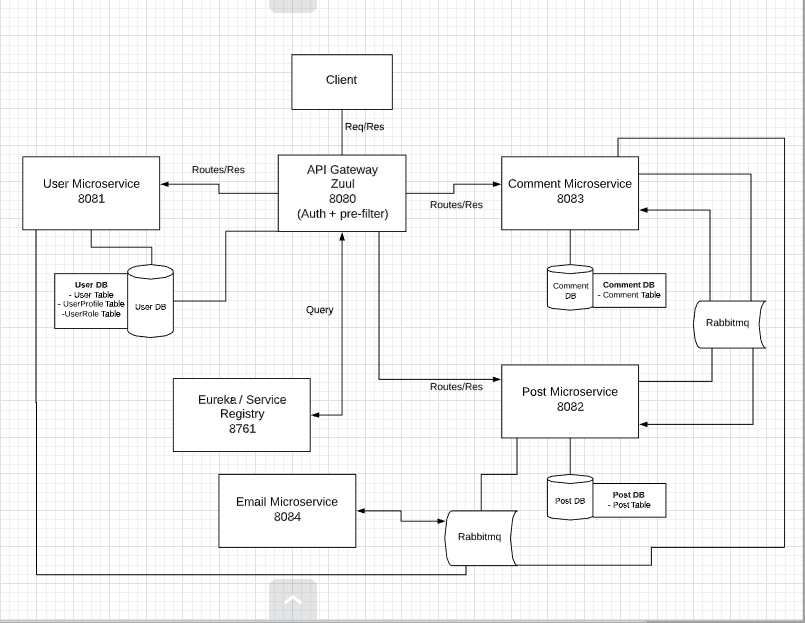

# Reddit-Clone-Microservices

Reddit-clone is a RESTful service with a microservice architecture allowing users to store their user details with authentication, posts, and comments. 

## Technologies Used
<li>
  Intellij
<li>
  Docker
<li>  
  Spring-boot
 <li> 
  Postman
 <li>
   Jenkins
  <li>
    ELK
  <li>
    Swagger
  <li>
    Javadoc
     

## Pivotal Tracker
- https://www.pivotaltracker.com/n/projects/2416905

## Design
This application was built using an API Gateway pattern, Netflix API gateway was used as a single entry point for all clients. The API gateway will handle the authentication and re-route the request to the appropriate microservice.

Each individual microservice has its own separate database which contains data only relevant to that microservice. Therefore, the Post microservice will not have access to the User or Comments database and vice versa. 

In order to display information to the UI and manage user data, these microservices and databases need to talk to each other to share data. Therefore, we implemented a messaging queue using RabbitMQ for all interservice communication.

 .png)

