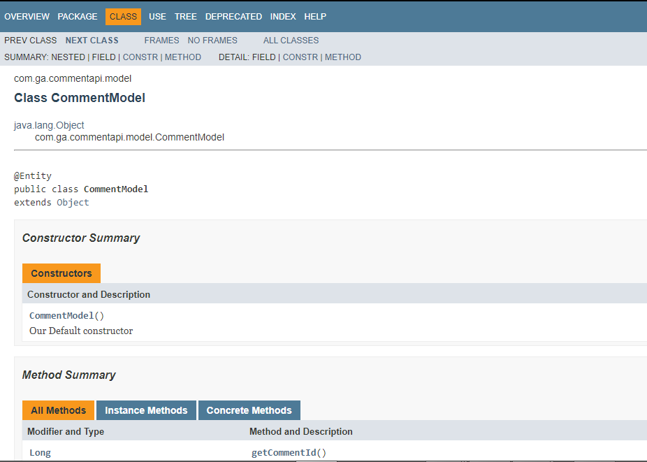

# Reddit-Clone-Microservices

## Technologies Used
<li>
  Intellij
<li>
  Docker
<li>  
  Spring-boot
 <li> 
  Postman
 <li>
   Jenkins
  <li>
    ELK
  <li>
    Swagger
  <li>
    Javadoc
     

## Pivotal Tracker
- https://www.pivotaltracker.com/n/projects/2416905

## Planning
  For this project, we divided our time between coding and researching so we can get the most out of the new information we recieved. Our research consisted of learning more about microservices and how they are implemented when using inter-service communication and security. On November 11th, we discussed general design and wrote our user stories on pivital tracker. On the 12th, we started creating the Api-Gsteway and the Eureka servers. On the 13th, we started coding our microservices Post and Comments. On the 14th, we started creating User service. Lastly, on the 15th, we worked on deploying our work to the cloud. 
  
  While researching, we were also developing our design for our project. As you can see in the diagram below, we used 3 services in our program: User, Post, and Comments. Each service has it's own database and each service has access to only it's database excluding User which shares a database with the Api-Gateway because that's where authorization is done. After creating our diagram, we made skeleton designs for our services and went back to doing more research on microservices. After gaining a general grasp on the idea, we started pair programming while we were on campus and assigning task for each other at home.
  
## DevOps
  After completing the backend, we were tasked with creating the documentation for it. The technologies we used for that were Swagger, Javadocs, Jenkins, and ELK logging. Each technology documented a different part of our code. Swagger is used for API documentation so we can recreate our API calls in a controled enviroment to show how they work. Javadocs is used to document one of our classes to show what each element of the class does. Jenkins is used to show our testing so we know if our code is actually working the way it's supposed to. ELK logging is to document traffic, errors, and other important information.

## Design

**Api-Gateway**
- API Gateway will act as the Authentication service. Once the validity of the token is confirmed, a pre-filter is applied to send to all route the username and userId in the request header.

**Inter-service Communication**
- We used RestTemplate for all interservice communication
- Post to Comment: Delete Post will call Comment microservice to delete all comments with deleted postId
- Comment to Post: Adding comment will first send a request to Post microservice with postId to confirm the existence of the postId. Comment will send either a HttpStatus.FOUND or HttpStatus.NOT_FOUND. If postId is found, the comment is created, else don't create and return null.

**Javadoc**

  

**Swagger**

**Jenkins**

**ELK**

## Problems Encountered
  This project was a hard one because of how complicated microservices were. Researching microservices lead to a lot of confusing information and differing of ideas. There were a lot of times where we just didn't know what to do and were stuck researching for a while to move on. Both microservices and cloud deployment gave us troubles because since they're fairly new material to us, we didn;t kniw how to properly implement them.
