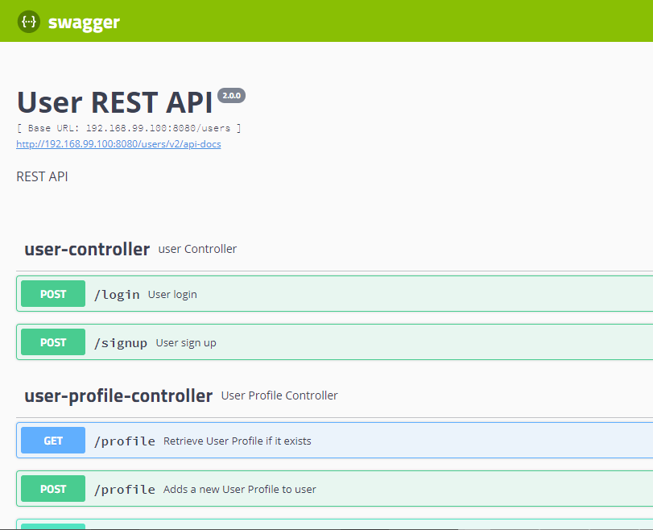

# Reddit-Clone-Microservices
 Welecome to our Reddit-clone Application using Microservices. For this project, we created a back-end for a preexising front-end application using Java Spring-Boot Microservices. This application is designed to function like the messaging board Reddit, where users can create a new user, create a post, and create a comment for those post. Other features includes updating your user information/profiles, deleting your post/comments, user authentication, and email notification. 

## Technologies Used
<li>
  Intellij
<li>
  Docker
<li>  
  Spring-boot
 <li> 
  Postman
 <li>
   Jenkins
  <li>
    ELK
  <li>
    Swagger
  <li>
    Javadoc
     

## Pivotal Tracker
- https://www.pivotaltracker.com/n/projects/2416905

## Planning
   
**Starter Code**
   
   For this project, we divided our time between coding and researching because we figured that we can get the most out of the new information we recieved by relying back and forth what we learned and putting it into practice. Our research consisted of learning more about microservices, how they are implemented when using inter-service communication, security. On November 11th, we discussed our general design by drawing our architecture and we wrote our user stories on pivital tracker. We also created skeleton code for our services. On the 12th, we started creating the Api-Gateway and the Eureka servers. On the 13th, we started coding our microservices Post and Comments. On the 14th, we started creating User service. Lastly, on the 15th, we worked on deploying our work to the cloud. 
  
  While researching, we were also developing our design for our project. As you can see in the diagram below, we used 3 services in our program: User, Post, and Comments. Each service has it's own database and each service has access to only it's database excluding User which shares a database with the Api-Gateway because that's where authorization is done. After creating our diagram, we made skeleton designs for our services and went back to doing more research on microservices. After gaining a general grasp on the idea, we started pair programming while we were on campus and assigning task for each other at home. For the second part of this project, we created another microservice called Email services, whose only job is to send out a email to the user whose post recieved a comment.
  
 **RabbitMq**
   
   For our interservice communication, we used a messaging queue called RabbitMq. The way our RabbitMq works is that it stores our requests from the services into queues and depending on the request, the services either sends information back to the requesting service or it just completes the request. Our RabbitMq server handles our interservice communications between the Post and Comments services and between all the services and the Email service. The communication between Post and Comments is described like so: 
    <li>
       When the request is to delete a Post, all comments associated to that Post gets deleted too. Therefore, our Post service sends a request to Comment serivce, sending the PostId of the post bound to get deleted, so the Comment service can delete all the comments on that post.
    <li>
       When the request is made to create a comment, Comment service sends a request to Post to check if the post exist. In this case, Post sends back a message saying if the post exist or not. If the post doesn't exist, the comment is not post. If the post does exist, the comment is posted.
     
  We also have RabbitMq for our services to talk to the Email service. Whenever a comment is posted, there's an option to notify the original poster that a comment has been posted.
  
**DevOps**
  
  After completing the backend, we were tasked with creating the documentation for it, testing the code, and depolying to the cloud. The technologies we used for that were Swagger, Javadocs, Jenkins, and Elstatic/Logstash/Kibana logging. Each technology documented a different part of our code. Swagger is used for API documentation so we can recreate our API calls in a controled enviroment to show how they work. Javadocs is used to document one of our classes to show what each element of the class does. Jenkins is used to show our testing in each of the services so we know if our code is actually working the way it's supposed to. ELK logging is used to document traffic, report errors, and log other important information.
  
  Our planning for creating the documentation was similar to planning for creating the backend, with a little more research. In this case, there was a lot more configuration we had to do to document our code, so we had to do more research on how to properly do the configurations for the documentation technologies. The only bits of code we had to write was for our unit and intergration testing so we split the work for unit testing by services and pair-programmed for the intergration test. Our configuration was split between technologies too because there were a lot of configurations that had to be done and we decided that the best way to tackle them is to divide and conquer the work. We still pair-programmed during some configurations to make sure everything is working on both of our consoles.

## Design
 .png)

**Api-Gateway**
- API Gateway will act as the Authentication service. Once the validity of the token is confirmed, a pre-filter is applied to send to all route the username and userId in the request header.

**Inter-service Communication**
- We used RestTemplate for all interservice communication
- Post to Comment: Delete Post will call Comment microservice to delete all comments with deleted postId
- Comment to Post: Adding comment will first send a request to Post microservice with postId to confirm the existence of the postId. Comment will send either a HttpStatus.FOUND or HttpStatus.NOT_FOUND. If postId is found, the comment is created, else don't create and return null.

**Javadoc**

  

**Swagger**

**Jenkins**

**ELK**

## Problems Encountered
  This project was a hard one because of how complicated microservices were. Researching microservices lead to a lot of confusing information and differing of ideas. There were a lot of times where we just didn't know what to do and were stuck researching for a while to move on. Both microservices and cloud deployment gave us troubles because since they're fairly new material to us, we didn;t kniw how to properly implement them.
  
  The configuration was also fairly stressful because it took a long time for at least one service to work. Also, if we wanted to change anything in the documentation/code, we had to re-run everything from scratch so that ate up a lot of time that could have been put to better use.
